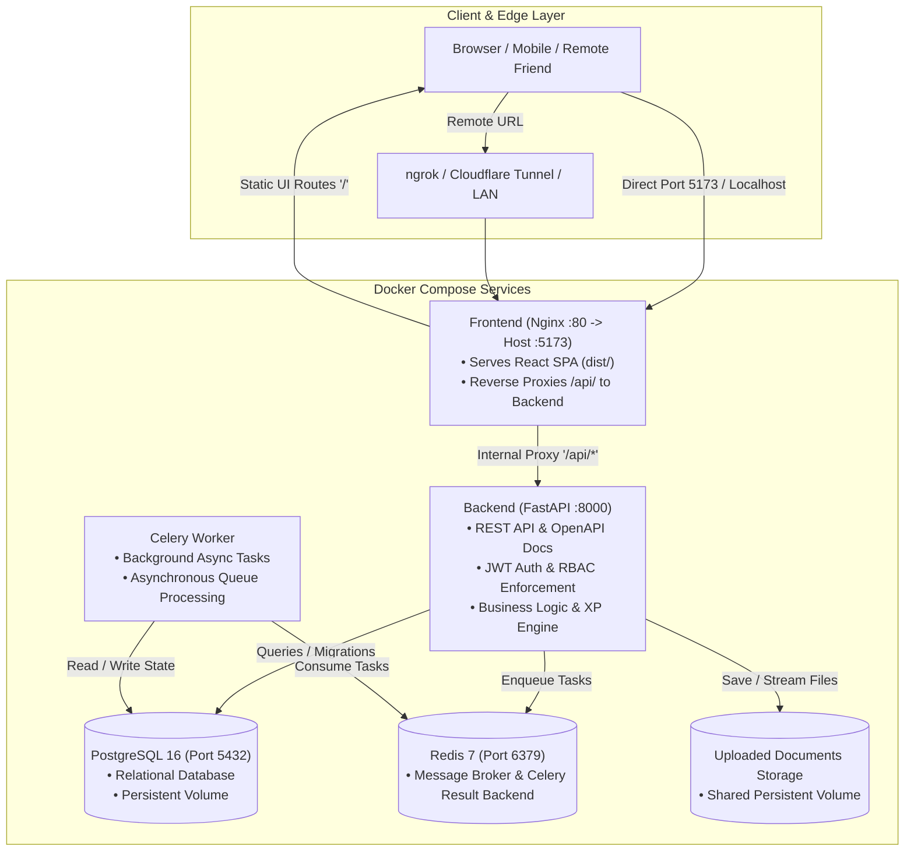
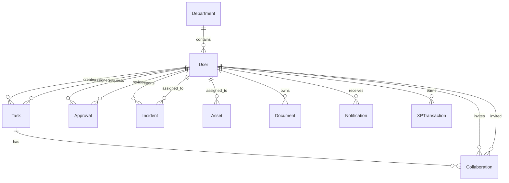

# OpsVault 🛡️⚡
> **Enterprise Operations Management & Employee Workflow Platform with Built-in Gamification (XP), Role-Based Access Control (RBAC), and Unified Reverse-Proxy Architecture.**

---

## 📑 Table of Contents
1. [Overview](#-overview)
2. [System Architecture](#-system-architecture)
   - [Architectural Topology](#architectural-topology)
   - [Unified Single-Origin Reverse Proxy](#unified-single-origin-reverse-proxy)
   - [Core Data & Relationship Map](#core-data--relationship-map)
3. [Technology Stack](#-technology-stack)
4. [Role-Based Access Control (RBAC) Matrix](#-role-based-access-control-rbac-matrix)
5. [Core Features & Modules](#-core-features--modules)
   - [1. Authentication & Security](#1-authentication--security)
   - [2. Employee & Department Management](#2-employee--department-management)
   - [3. Task Management & Workflows](#3-task-management--workflows)
   - [4. Gamification & XP System](#4-gamification--xp-system)
   - [5. Employee Request & Approval Lifecycle](#5-employee-request--approval-lifecycle)
   - [6. Incident & Issue Tracking](#6-incident--issue-tracking)
   - [7. Asset Tracking & Hardware Inventory](#7-asset-tracking--hardware-inventory)
   - [8. Document Vault & Secure Storage](#8-document-vault--secure-storage)
   - [9. Real-Time Notification System](#9-real-time-notification-system)
6. [Quick Start Guide](#-quick-start-guide)
   - [Option A: Docker Compose (Recommended)](#option-a-docker-compose-recommended)
   - [Option B: Manual Local Development](#option-b-manual-local-development)
7. [Default Seeded Credentials](#-default-seeded-credentials)
8. [Remote Sharing & Testing (ngrok / Cloudflare / LAN)](#-remote-sharing--testing-ngrok--cloudflare--lan)
9. [Automated Test Suite](#-automated-test-suite)
10. [Environment Variables Reference](#-environment-variables-reference)

---

## 🌟 Overview

**OpsVault** is a full-stack, enterprise-grade operations workspace built for modern organizations to manage daily workflows, track assets and incidents, assign and review requests, collaborate on tasks, and motivate teams through an automated XP (Experience Points) and leveling engine.

OpsVault enforces strict **Role-Based Access Control (RBAC)** across three primary tiers: **Administrator**, **Manager**, and **Employee**, ensuring data privacy, department boundaries, and secure operations.

---

## 🏛️ System Architecture

OpsVault uses a decoupled micro-service container architecture where every component is isolated, stateless, and scalable.

### Architectural Topology



### Unified Single-Origin Reverse Proxy

OpsVault eliminates Cross-Origin Resource Sharing (CORS) friction and complex multi-port tunneling by embedding an **Nginx reverse proxy** inside the frontend container:
- **Port 5173** serves both the React static single-page application (SPA) and proxies all `/api/v1/*` requests directly to `http://backend:8000/api/v1/*` within the Docker virtual network.
- **Benefits**:
  1. Only **one single port (`5173`)** needs to be exposed or tunneled.
  2. Public tunneling (`ngrok http 5173`) works instantaneously without backend-frontend domain mismatch or broken authentication.
  3. Cookies/JWT tokens and session headers travel seamlessly on the same origin.

### Core Data & Relationship Map



---

## 🛠️ Technology Stack

| Layer | Technology | Description |
|---|---|---|
| **Frontend** | **React 18 / 19** | Modern component-based single-page application with functional hooks. |
| **Build Tool** | **Vite** | Ultra-fast client build pipeline with dynamic development proxying. |
| **Icons & UI** | **Lucide Icons & Modern CSS** | Accessible, responsive CSS design system with light/dark glassmorphic aesthetic. |
| **Web Server** | **Nginx 1.27 Alpine** | Production static asset server & reverse proxy forwarder. |
| **Backend API** | **FastAPI 0.115+** | High-performance Python async REST API framework with automatic OpenAPI documentation. |
| **ORM & Migrations** | **SQLAlchemy 2.0 & Alembic** | Robust relational mapping, typed database models, and versioned schema migrations. |
| **Database** | **PostgreSQL 16 Alpine** | ACID-compliant relational database with foreign key constraints. |
| **Task Queue & Cache** | **Celery 5.4 + Redis 7** | Distributed background worker queue for asynchronous and periodic tasks. |
| **Security & Auth** | **PyJWT + Passlib (Bcrypt)** | Dual-token authentication (Access Token + Refresh Token) with hashed passwords. |
| **Testing** | **pytest + HTTPX + Starlette TestClient** | Automated test suite validating RBAC, data isolation, and API integrity. |

---

## 🔒 Role-Based Access Control (RBAC) Matrix

| Module / Action | Administrator | Manager | Employee |
|---|:---:|:---:|:---:|
| **User Management** (Create / Update / Delete users) | ✅ Full Access | 🔶 View & Update own dept employees | ❌ Forbidden |
| **Department Management** (Create / Edit / Delete) | ✅ Full Access | ❌ Cannot create/delete | ❌ View own department only |
| **Assign / Unassign Department Employees** | ✅ All Depts | 🔶 Own Dept Only | ❌ Forbidden |
| **Create Assigned Tasks** | ✅ Any Employee | 🔶 Own Dept Employees | ❌ Forbidden |
| **Create Personal Tasks** | ✅ Yes | ✅ Yes | ✅ Yes (Auto-assigned to self) |
| **Update Task Details** (Title, Assignee, Priority) | ✅ Yes | 🔶 Managed Tasks | 🔶 Personal Tasks only |
| **Update Task Status** (Pending ➔ In Progress ➔ Done) | ✅ Yes | ✅ Yes | ✅ Assigned & Personal tasks |
| **Delete Tasks** | ✅ Any Task | 🔶 Department Tasks | 🔶 Personal Tasks only |
| **Submit Requests / Queries** | ✅ Yes | ✅ Yes | ✅ Yes |
| **Decide Requests** (Approve / Reject) | ✅ All Requests | 🔶 Own Dept Requests | ❌ Forbidden |
| **Incidents & Issue Tracker** | ✅ Full CRUD | 🔶 Dept Incidents | 🔶 Own Reported Incidents |
| **Asset Management** | ✅ Full CRUD | 🔶 View & Update Dept Assets | 🔶 View assigned assets |
| **Document Vault** (Upload / Download) | ✅ All Documents | 🔶 Dept & Own Documents | 🔶 Own & Dept Documents |
| **Gamification & XP History** | ✅ Full View | ✅ Full View | ✅ View own XP & Level |

---

## 🚀 Core Features & Modules

### 1. Authentication & Security
- **Dual JWT Token Architecture**: Employs short-lived `access_token` (30 mins) for API authorization and long-lived `refresh_token` (14 days) with automatic silent token rotation.
- **Password Security**: Passwords are one-way hashed using **Bcrypt** with salt.
- **Role Guards**: Custom FastAPI dependencies (`current_user`, `roles(...)`, `can_manage_departments`) prevent privilege escalation.

### 2. Employee & Department Management
- **Department Association**: Employees are assigned to organizational units (e.g., *Engineering*, *Operations*, *Customer Support*).
- **Manager Delegation**: Managers can assign or unassign employees strictly within their own department.
- **Admin Supervision**: Admins can create departments, modify assignments, and manage all user accounts.

### 3. Task Management & Workflows
- **Assigned Tasks**: Created by Admins or Managers and assigned to specific employees. Employees cannot alter title, description, or assignment, but can transition task status.
- **Personal Tasks**: Employees can create private tasks to manage their own to-do items. The backend automatically prevents employees from assigning tasks to third parties.
- **Finite State Machine**: Validates status transitions:
  $$\text{PENDING} \longrightarrow \text{IN\_PROGRESS} \longrightarrow \text{COMPLETED} \quad (\text{or } \text{DROPPED})$$

### 4. Gamification & XP System
- Completing tasks automatically grants **Experience Points (XP)** based on task difficulty:
  - **Easy**: `+50 XP`
  - **Medium**: `+100 XP`
  - **Hard**: `+200 XP`
  - **Critical**: `+500 XP`
- **Duplicate Prevention**: XP is awarded atomically using unique `XPTransaction` records so tasks cannot be exploited by toggling completion.
- **Level Scaling**: Progressive formula:
  $$\text{Level} = \left\lfloor \frac{\text{XP}}{200} \right\rfloor + 1$$

### 5. Employee Request & Approval Lifecycle
- Employees submit formal requests (e.g., equipment purchase, leave, permission elevation).
- Admins and Managers view the incoming request queue with full employee details, submission timestamps, and actionable **Approve** and **Reject** buttons with review comments.
- Status changes automatically trigger in-app notifications for the requester.

### 6. Incident & Issue Tracking
- Track operational outages, security incidents, or technical bugs with severity classification (`LOW`, `MEDIUM`, `HIGH`, `CRITICAL`).
- Assign incidents to dedicated responders, log resolutions, and maintain an audit history.

### 7. Asset Tracking & Hardware Inventory
- Catalog company laptops, monitors, software licenses, and server hardware with unique `asset_tag` tracking.
- Assign assets to employees or departments to maintain hardware accountability.

### 8. Document Vault & Secure Storage
- Upload and archive files (PDF, DOCX, TXT, PNG, JPEG) with a 10 MB per-file safety limit.
- **Authenticated Downloads**: Files are stored securely on the backend volume and streamed only to authenticated users with valid department or ownership permissions.

### 9. Real-Time Notification System
- Instant in-app alerts whenever:
  - A new task is assigned to an employee.
  - A request/query is approved or rejected by a manager.
  - A collaboration invitation is sent or responded to.
- Users can view, mark as read, or dismiss notifications.

---

## ⚡ Quick Start Guide

### Option A: Docker Compose (Recommended)

Ensure [Docker Desktop](https://www.docker.com/products/docker-desktop/) is running, then execute:

```powershell
# 1. Navigate to the project root
cd wa

# 2. Build and start all 5 containers
docker compose up --build -d

# 3. Check service health
docker compose ps
```

Once started:
- **Frontend App**: [http://localhost:5173](http://localhost:5173)
- **Backend API & Swagger Docs**: [http://localhost:8000/docs](http://localhost:8000/docs)
- **API Health Check via Proxy**: [http://localhost:5173/api/v1/openapi.json](http://localhost:5173/api/v1/openapi.json)

---

### Option B: Manual Local Development

#### 1. Backend Setup
```powershell
cd wa/backend

# Create & activate virtual environment
python -m venv .venv
.\.venv\Scripts\Activate.ps1

# Install dependencies
pip install -r requirements.txt

# Run migrations & start FastAPI server
alembic upgrade head
uvicorn app.main:app --reload --port 8000
```

#### 2. Frontend Setup
```powershell
cd wa/frontend

# Install node dependencies
npm install

# Start Vite development server
npm run dev
```

---

## 🔑 Default Seeded Credentials

When running with development seeding enabled (`DEV_SEED_USERS: "true"`), the following accounts are pre-configured:

| Role | Name | Email | Password |
|---|---|---|---|
| **Administrator** | Kunal | `admin@opsvault.local` | `OpsVaultTest!2026` |
| **Manager** | Maya Manager | `manager@opsvault.local` | `OpsVaultTest!2026` |
| **Employee 1** | Arjun Employee | `employee1@opsvault.local` | `OpsVaultTest!2026` |
| **Employee 2** | Riya Employee | `employee2@opsvault.local` | `OpsVaultTest!2026` |

*You can also register brand new employee accounts directly on the login screen.*

---

## 🌐 Remote Sharing & Testing (ngrok / Cloudflare / LAN)

Because of OpsVault's unified reverse-proxy architecture, you only need **one single tunnel** to share both the frontend and backend with remote teammates or friends:

```powershell
# Expose the unified frontend + backend proxy port
ngrok http 5173
```

1. Copy the public URL provided by ngrok (e.g. `https://xxxx.ngrok-free.app`).
2. Send the link to your friend.
3. Both of you can browse, log in, manage tasks, and test all features simultaneously without CORS errors or separate backend tunnels.

---

## 🧪 Automated Test Suite

OpsVault includes an end-to-end integration test suite covering RBAC rules, task workflows, XP calculations, department employee assignments, and document authorization.

To execute the test suite:

```powershell
cd wa/backend
python -m pytest -v
```

### Test Suite Coverage:
- `test_public_registration_cannot_elevate`: Verifies public registration cannot create Admin/Manager accounts.
- `test_login_and_admin_create_user`: Verifies authentication and employee listing in Admin Panel.
- `test_employee_personal_task_and_assignment_restrictions`: Verifies employee task creation and assignment isolation.
- `test_admin_manager_assign_task_and_notifications`: Verifies task assignment and automated notification delivery.
- `test_employee_task_status_updates`: Verifies state transitions and prevents unauthorized task modifications.
- `test_task_deletion_rbac`: Verifies deletion permission boundaries across roles.
- `test_employee_request_lifecycle`: Verifies approval creation, manager decisions, and requester alerts.
- `test_department_management_and_employee_assignment`: Verifies department employee linking and unlinking.
- `test_task_completion_awards_xp_once`: Verifies idempotent XP awards and leveling calculations.
- `test_incidents_crud`: Verifies incident reporting and department scoping.
- `test_assets_crud`: Verifies hardware asset registration and assignment.
- `test_documents_crud_and_download`: Verifies secure authenticated document upload and streaming.

---

## ⚙️ Environment Variables Reference

| Variable | Default Value | Description |
|---|---|---|
| `DATABASE_URL` | `postgresql+psycopg://...` | Connection string for PostgreSQL database. |
| `SECRET_KEY` | `development-secret` | Cryptographic secret for signing JWT tokens. |
| `ACCESS_TOKEN_MINUTES` | `30` | Access token lifespan in minutes. |
| `REFRESH_TOKEN_DAYS` | `14` | Refresh token lifespan in days. |
| `FRONTEND_ORIGINS` | `http://localhost:5173` | Allowed CORS origins for external direct API access. |
| `UPLOAD_DIR` | `/app/uploads` | Path to persistent document uploads directory. |
| `DEV_SEED_USERS` | `true` | Seeds initial development accounts on startup when enabled. |
| `VITE_API_BASE_URL` | `/api/v1` | Base API prefix for frontend HTTP calls. |
| `VITE_DEV_TEST_USERS` | `true` | Enables quick-fill demo credentials on frontend login form. |

---

## 📄 License
OpsVault is distributed under the MIT License. See `LICENSE` for more information.
